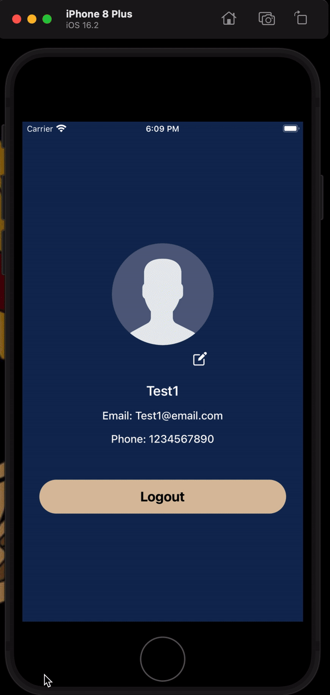

# React Native Supabase Demo App

This React Native application serves as a demonstration of various features provided by Supabase including authentication, database, and storage.

- Sign Up


- Login


- Upload



## Features

- **Authentication**: Users can sign up, log in, and log out using email/password authentication.
- **Database**: CRUD operations with a database hosted on Supabase.
- **Storage**: Upload and update files to Supabase storage.

## Requirements

- Node.js
- npm or yarn
- React Native development environment set up

## Installation

1. Clone the repository:

   ```bash
   git clone https://github.com/PrayagJoshi10/SupaDemo-ReactNative.git
   ```

2. Navigate to the project directory:

   ```bash
   cd SupaDemo-ReactNative
   ```

3. Install dependencies using yarn:

   ```bash
   yarn install
   ```

## Usage

1. Set up environment variables:

   - Create a .env file in the root directory.
   - Add your Supabase credentials to the .env file:

   ```
   SUPABASE_URL=
   SUPABASE_ANON_KEY=
   ```

2. Start the Metro bundler:

   ```bash
   npx react-native start
   ```

3. Run the application on a connected emulator or device:

   ```bash
   npx react-native run-android
   # or
   npx react-native run-ios
   ```

## Dependencies

- React Navigation: For managing navigation in the React Native app.
- Supabase: @supabase/supabase-js
- base64-arraybuffer
- react-native-image-picker
- @react-native-async-storage/async-storage
- react-native-url-polyfill

## Author

Prayag Joshi
